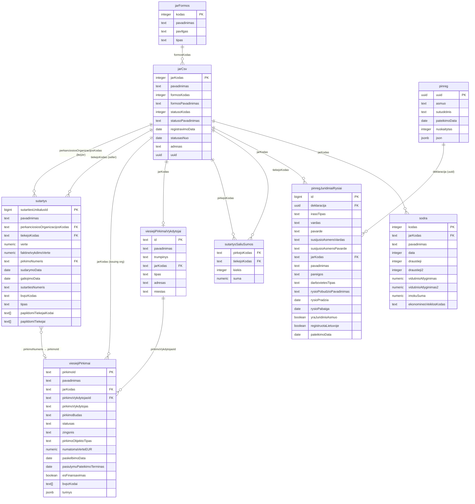

# Database Entity–Relationship Diagram

This document describes the key PostgreSQL tables used by the **Voratinklis** graph and the broader
**viešpirkiai** platform. All tables live in the `public` schema; the owner is `admin`.

---

## Core tables and relationships

---

## Voratinklis graph — node data sources

| Graph node type      | Primary table(s)                         | Join key                                                          |
|----------------------|------------------------------------------|-------------------------------------------------------------------|
| `OrganizationEntity` | `jarCsv`                                 | `jarKodas`                                                        |
| `PersonEntity`       | `pinregJuridiniaiRysiai`                 | `vardas + pavarde` (person identity key)                          |
| `ContractEntity`     | `sutartys JOIN jarCsv`                   | `sutartiesUnikalusId`; partner names via `jarCsv`                 |
| `ProcurementEntity`  | `viesiejiPirkimai`                       | `pirkimoId`; buyer org via `jarKodas`                             |

## Key relationships used by graph expansion

| Relationship                              | SQL join                                                                               |
|-------------------------------------------|----------------------------------------------------------------------------------------|
| Org → top contracts (as buyer)            | `sutartys WHERE perkanciosiosOrganizacijosKodas = $jarKodas ORDER BY verte DESC`       |
| Org → top contracts (as seller)           | `sutartys WHERE tiekejoKodas = $jarKodas ORDER BY verte DESC`                          |
| Org → procurements (as issuer)            | `viesiejiPirkimai WHERE jarKodas = $jarKodas ORDER BY numatomaVerteEUR DESC`           |
| Procurement → winning orgs (as sellers)   | `sutartys WHERE pirkimoNumeris = $pirkimoId GROUP BY tiekejoKodas`                     |
| Org → persons (declared relationships)    | `pinregJuridiniaiRysiai WHERE jarKodas = $jarKodas`                                    |
| Org → employee count (most recent sodra)  | `sodra WHERE jarKodas = $jarKodas ORDER BY data DESC NULLS LAST LIMIT 1`               |
| Person → all orgs (across declarations)   | `pinregJuridiniaiRysiai WHERE vardas=$v AND pavarde=$p` (+ spouse variant)             |
| Org partner names                         | `jarCsv WHERE jarKodas = ANY($codes)` — used to resolve names from sutartys/pirkimai  |

---

## Notes

- **`viesiejiPirkimaiVykdytojai`** is a separate organiser registry (procurement-running body). It has
  its own `id` and optionally maps to a `jarCsv` entry via `jarKodas`. The `viesiejiPirkimai.jarKodas`
  column directly references `jarCsv` and is the canonical buyer identity used in the graph.

- **`sutartys.pirkimoNumeris`** is a `text` FK to `viesiejiPirkimai.pirkimoId`. It is nullable —
  roughly 30–40 % of contracts were signed without a published procurement notice (direct procurement
  below threshold). **One procurement can have multiple contracts with different sellers** (32,605 of
  37,796 procurements have >1 distinct winner), making `ProcurementEntity` a natural hub node in the
  graph.

- **`sodra.data`** is an integer in `YYYYMM` format (e.g. `202403`). Always `ORDER BY data DESC NULLS
  LAST` and take the first row to get the most recent snapshot. `bendrasDraustujuSkaicius` is not a
  column — it is computed as `draustieji + draustieji2` in application code.

- **`pinregJuridiniaiRysiai.irasoTipas`** has three values: `DEKLARUOJANCIO_DARBOVIETE`,
  `SUTUOKTINIO_DARBOVIETE`, `KITI_RYSIAI_SU_JA`. These are record classifiers, not role labels — do
  not use them as edge labels in the graph.
