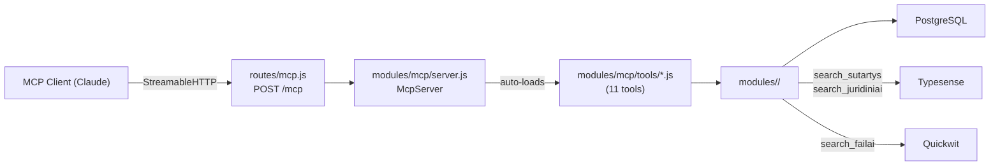
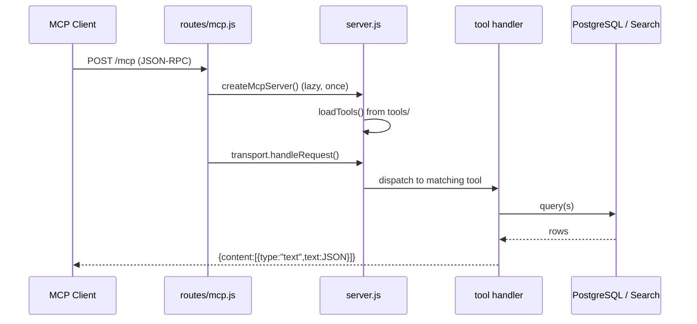

# How MCP Works and Which Database Tables Each Tool Uses

## Summary

The MCP (Model Context Protocol) integration exposes this project's procurement data to AI assistants like Claude. It is part of the **web server** process: `routes/mcp.js` accepts `POST /mcp` requests, lazily creates an `McpServer` instance via `modules/mcp/server.js`, and handles the request using the `@modelcontextprotocol/sdk` StreamableHTTP transport. The server auto-loads all 11 tool files from `modules/mcp/tools/`. Each tool is a thin adapter: it validates inputs with Zod, calls the same domain module functions used by the website's routes, and returns JSON as MCP text content. Depending on the tool, queries go to PostgreSQL directly, or through Typesense (full-text contract/company search) or Quickwit (full-text document search) with PostgreSQL as fallback.

## Structural view

## Behavioral view

## Tool → Database table mapping

```mermaid
flowchart LR
    subgraph DB["PostgreSQL Tables"]
        T_sutartys[("sutartys\nsutartiesUnikalusId · pavadinimas · verte\nperkanciosiosOrganizacijosKodas · tiekejoKodas\npirkimoNumeris · tipas")]
        T_sutartysAtviri[("sutartysAtviriDuomenys\nsutartysAtviriDuomenysImp\ntiekPavPatikslinimas · tiekSalis\ntiekSbjPatikslinimas")]
        T_sabis[("sabisSutartys · sabisSutarciuSalys\nsabisSaskaitos · sabisSaskaituSalys\nvpId · sutartiesId · sutartiesUid · sfId")]
        T_cpva[("cpvaProjektuSutartys · cpvaProjektuSarasas\npirkimoNrCvpis · projektoNr")]
        T_cvpp[("cvppViesiejiPirkimai\npirkimoNumeris")]
        T_vp[("viesiejiPirkimai\npirkimoId · pavadinimas · statusas\npirkimoBudas · numatomaVerteEUR\nbvpzKodai")]
        T_vpVykd[("viesiejiPirkimaiVykdytojai\nid · pavadinimas · jarKodas")]
        T_jarCsv[("jarCsv · jar\njarKodas · pavadinimas\nformosKodas · location")]
        T_failai[("failai\nid · md5 · dokId · fileId\nparsiustas · nuskaitytas\nsaltinis · saltinioId")]
        T_failaiTekstas[("failaiTekstas\nid · tekstas")]
        T_failaiMeta[("failaiTelefonai · failaiEmails\nfailaiDomains · failaiIban\nfailaiJarKodai")]
        T_failaiStorage[("failuPasalinimai · failaiDezes\ndezes · apiRaktai")]
        T_pinreg[("pinreg\nvardas · pavarde · pareigos")]
        T_pinregJar[("pinregJuridiniaiRysiai\nirasoTipas · jarKodas\nvardas · pavarde")]
        T_eiluciai[("eiluciuSkaiciai\ntableName · rowCount")]
        T_juridiniaiSub[("sodra · vmiDuomenys · regitraDuomenys\nteismoNuosprendziai · nepatikimiTiekejai\nmelagingiTiekejai · jadisDuomenys\nrcPranesimai · domenai · kotisIrasai\nesInvesticijos · mvpTvarkosAprasai\nvdiPazeidimai · finansai · darboSkelbimai\nistatinisKapitalas")]
    end

    subgraph Tools["Tools"]
        get_sutartis["get_sutartis"]
        search_sutartys["search_sutartys\n(Typesense / PG)"]
        get_vp["get_viesasis_pirkimas"]
        search_vp["search_viesieji_pirkimai"]
        get_juridinis["get_juridinis"]
        search_juridiniai["search_juridiniai\n(Typesense / PG)"]
        get_failas["get_failas"]
        get_failas_tekstas["get_failas_tekstas"]
        search_failai["search_failai\n(Quickwit / PG)"]
        get_pinreg_asmuo["get_pinreg_asmuo"]
        get_pinreg_jar["get_pinreg_jar"]
    end

    T_sutartys -->|" primary row "| get_sutartis
    T_sutartysAtviri -->|" supplier correction "| get_sutartis
    T_sabis -->|" SABIS contracts + invoices "| get_sutartis
    T_cpva -->|" EU project links "| get_sutartis
    T_cvpp -->|" CVPP / CVPIS lookup "| get_sutartis
    T_vp -->|" related procurement "| get_sutartis
    T_failai -->|" document status "| get_sutartis

    T_sutartys -->|" search rows "| search_sutartys
    T_eiluciai -->|" row count "| search_sutartys

    T_vp -->|" primary row "| get_vp
    T_vpVykd -->|" JOIN executor "| get_vp
    T_failai -->|" file versions "| get_vp

    T_vp -->|" search rows "| search_vp
    T_eiluciai -->|" row count "| search_vp

    T_jarCsv -->|" company record "| get_juridinis
    T_sutartys -->|" contracts summary "| get_juridinis
    T_pinregJar -->|" PINREG links "| get_juridinis
    T_juridiniaiSub -->|" parallel fan-out\n(15+ sub-modules) "| get_juridinis

    T_jarCsv -->|" search rows "| search_juridiniai

    T_failai -->|" primary row "| get_failas
    T_failaiTekstas -->|" JOIN text preview "| get_failas
    T_failaiStorage -->|" access check + storage URL "| get_failas

    T_failai -->|" primary row "| get_failas_tekstas
    T_failaiTekstas -->|" paginated text "| get_failas_tekstas
    T_failaiStorage -->|" access check "| get_failas_tekstas

    T_failai -->|" search rows "| search_failai
    T_failaiTekstas -->|" FTS via tsvector "| search_failai
    T_failaiMeta -->|" subquery filters\n(phone · email · domain\nIBAN · JAR code) "| search_failai

    T_pinreg -->|" by name "| get_pinreg_asmuo
    T_pinregJar -->|" by JAR code "| get_pinreg_jar
```

| MCP Tool | SQL Tables | Typesense | Quickwit | Description |
|----------|-----------|:---------:|:--------:|-------------|
| `get_sutartis` | `sutartys`, `sutartysAtviriDuomenys`, `sutartysAtviriDuomenysImp`, `failai`, `sabisSutartys`, `sabisSutarciuSalys`, `sabisSaskaitos`, `sabisSaskaituSalys`, `cpvaProjektuSutartys`, `cpvaProjektuSarasas`, `cvppViesiejiPirkimai`, `viesiejiPirkimai` | — | — | Fetch full contract detail by ID, including SABIS invoices, EU projects, and document download status |
| `search_sutartys` | `sutartys`, `eiluciuSkaiciai` | ✓ primary | — | Full-text + filtered contract search; falls back to PostgreSQL when Typesense is off |
| `get_viesasis_pirkimas` | `viesiejiPirkimai`, `viesiejiPirkimaiVykdytojai`, `failai` | — | — | Fetch full procurement notice by `pirkimoId`, with executor JOIN and local file versions |
| `search_viesieji_pirkimai` | `viesiejiPirkimai`, `eiluciuSkaiciai`, `bvpzKodai` | — | — | Search procurement notices by name, status, procedure type, date, value, CPV codes |
| `get_juridinis` | `jarCsv`, `jar`, `sutartys`, `pinregJuridiniaiRysiai`, + 15 sub-module tables | — | — | Aggregate company profile: register data, Sodra, VMI, court verdicts, PINREG, domains, etc. |
| `search_juridiniai` | `jarCsv` | ✓ primary | — | Search companies by name, address, or geo-coordinates |
| `get_failas` | `failai`, `failaiTekstas`, `failuPasalinimai`, `failaiDezes`, `dezes`, `apiRaktai` | — | — | Fetch document metadata + first 3 pages of OCR text; includes IBAN, JAR codes, emails found in doc |
| `get_failas_tekstas` | `failai`, `failaiTekstas`, `failuPasalinimai` | — | — | Paginated OCR text retrieval (up to 25 pages at a time) after `get_failas` |
| `search_failai` | `failai`, `failaiTekstas`, `failaiTelefonai`, `failaiEmails`, `failaiDomains`, `failaiIban`, `failaiJarKodai` | — | ✓ primary | Full-text document search; phone/email/IBAN/JAR subquery filters always go to PostgreSQL |
| `get_pinreg_asmuo` | `pinreg` | — | — | Private-interest declarations by person name (declarant's workplaces and company links) |
| `get_pinreg_jar` | `pinregJuridiniaiRysiai` | — | — | Private-interest declarations linked to a company JAR code |

## Key files

| File | Role |
|------|------|
| `routes/mcp.js` | HTTP entry point; lazy-creates MCP server per request |
| `modules/mcp/server.js` | Creates `McpServer`, auto-loads all tools from `tools/` |
| `modules/mcp/tools/*.js` | One file per tool: exports `name`, `description`, `schema` (Zod), `handler` |
| `modules/sutartys/searchSutartys.js` | Contract search used by `search_sutartys` |
| `modules/viesiejiPirkimai/searchViesiejiPirkimai.js` | Procurement search used by `search_viesieji_pirkimai` |
| `modules/failai/queries.js` | `findFailas` + `checkFailasAccessible` used by file tools |
| `modules/failai/searchFailai.js` | Document full-text search with Quickwit/PG routing |
| `modules/juridiniai/getJuridinisInfo.js` | Aggregates company data from ~15 sub-modules |
| `modules/juridiniai/search.js` | Company search via Typesense/PG |
| `modules/pinreg/pagalVarda.js` | PINREG by person name → `pinreg` table |
| `modules/pinreg/pinregDeklaracijos.js` | PINREG by company code → `pinregJuridiniaiRysiai` |

## Design decisions & trade-offs

- **Lazy server instantiation**: `mcpImports` is populated on the first POST request and reused. This avoids loading the MCP SDK and all tool modules until the endpoint is actually called.
- **No session IDs** (`sessionIdGenerator: undefined`): Each POST creates a fresh server + transport, making the endpoint stateless. This simplifies deployment at the cost of not supporting multi-turn MCP sessions.
- **Search engine routing per tool**: `search_sutartys` and `search_juridiniai` use Typesense when available; `search_failai` uses Quickwit when available. Both fall back to PostgreSQL gracefully — the same logic used by the website.
- **`get_juridinis` result size**: The handler accepts per-category `limit` overrides to control response size, because the underlying `getJuridinisInfo()` can return very large aggregated payloads.
- **`search_failai` strips `tekstas` and `search_index`**: These heavy columns are removed before returning to Claude to keep response sizes manageable.

## Open questions / gaps

- The exact column-level schema for each table is not documented here; see `docs/DB_ER.md` for the ER diagram.
- Sub-module table names for `get_juridinis` were inferred from function/file names, not from reading every sub-module's SQL — a few may differ.
