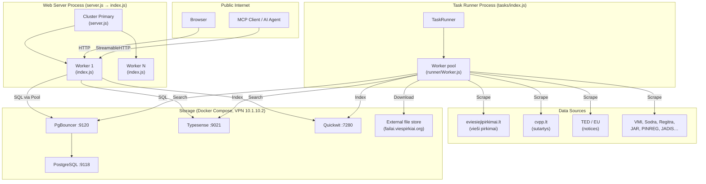

# Viešpirkiai

## Main Functionality and Use Cases

Lithuanian civic transparency platform aggregating public procurement data from multiple government sources:

- **eviesiejipirkimai.lt** — public procurement notices (vieši pirkimai)
- **cvpp.lt** — public contracts (sutartys)
- **TED (EU)** — European procurement notices
- **Registrų Centras / JAR** — company registry (juridiniai asmenys)
- **PINREG** — public interest declarations (privačių interesų deklaracijos)
- **VMI, Sodra, Regitra, JADIS, SABIS** — tax, social insurance, vehicle, and financial data
  .
  Core user-facing features:

- Full-text and faceted search over contracts and procurement notices
- Entity pages: contractor (tiekejas), buyer (pirkejas), legal person (asmuo), contract (sutartis)
- Document file viewer with OCR text extraction
- Conflict-of-interest detection (PINREG ↔ contracts)
- MCP server (AI tool integration) at `/mcp`

---

## Technology Stack

| Layer               | Technology                                                |
|---------------------|-----------------------------------------------------------|
| Runtime             | Node.js (ESM, `"type": "module"`)                         |
| Web framework       | Express 5                                                 |
| Templating          | EJS (compiled + cached in production)                     |
| CSS                 | Tailwind v4 (via PostCSS) + legacy custom CSS             |
| Graph visualisation | Sigma.js 3 + graphology 0.26 (browser bundle via esbuild) |
| Primary DB          | PostgreSQL 17 (via `pg` Pool)                             |
| Connection pool     | PgBouncer                                                 |
| Full-text search    | Typesense 28 (contracts)                                  |
| Document search     | Quickwit (file text content)                              |
| Containerisation    | Docker Compose                                            |
| Networking          | WireGuard VPN (`wireproxy`)                               |

---

## System View



---

## Basic Data Structures

### Sutartis (contract)

Stored in PostgreSQL table `sutartys` and indexed in Typesense collection `sutartys` (schema version tracked in
`typesense/typesense.js`).

Key fields: `sutartiesUnikalusId`, `pavadinimas`, `perkanciojiOrganizacija`, `perkanciosiosOrganizacijosKodas`,
`tiekejas`, `tiekejoKodas`, `verte`, `suma`, `sudarymoData`, `galiojimoData`, `bvpzKodas`, `tipas`

Supplementary table `sutartysAtviriDuomenys` (joined by `dokId`) holds open-data corrections (e.g.
`tiekPavPatikslinimas`).

### Viesasis Pirkimas (public procurement notice)

Stored in PostgreSQL. Scraped from three API endpoints — `CfTDPSWS`, `CfTWS`, `PMC`. Status and process type enums
defined in `modules/viesiejiPirkimai/viesiejiPirkimaiEnums.js`.

### Failas (document file)

PostgreSQL `failai` table. Fields include `md5`, `url`, `extension`, `text` (OCR result), `autorius` (parsed signatory),
download/OCR reservation columns.

Queried via `modules/failai/queries.js`. Full-text indexed in Quickwit.

### Juridinis Asmuo (legal entity)

Central entity linked to JAR (company registry). `jarKodas` (company code) is the universal join key across tables (
`sutartys`, `pinreg`, `sodra`, `vmi`, `regitra`, `domenai`, …).

### Task definition

```js
{
    name: string,
        mode
:
    "asap" | undefined,   // "asap" = continuous loop; omit for cron
        schedule
:
    string | undefined, // cron expression, used if mode is not "asap"
        priority
:
    1–10,
        cooldown
:
    number,           // seconds between successful runs
        errorCooldown
:
    number,      // seconds after a failure
        concurrency
:
    number,        // parallel workers for this task
        job
:
    async () => any,
        onSuccess
:
    (runner) => void // optional; use runner.nudge() for downstream
}
```

---

## Persistence / Database Layer

### PostgreSQL

`postgres/postgres.js` creates a single `pg.Pool` used by both the web server and (indirectly) task runner modules. Key
config:

- `statement_cache_size: 0` — required for PgBouncer transaction-pooling mode
- Type parsers: `DATE`/`TIMESTAMP` → string, `NUMERIC` → float (set globally via `pg.types`)
- `parsePgArray(str)` utility for PostgreSQL array literals

In production the web server connects via PgBouncer (`:9120`); direct Postgres is `:9118`.

### Typesense

`typesense/typesense.js` exports `client`, `ensureSearchCollection()`, `ensureJarCollection()`, and CRUD helpers. Schema
versioning: if `metadata.version` on the existing collection differs from `SCHEMA_VERSION` constant the collection is
dropped and recreated.

### Quickwit

`quickwit/quickwit.js` — HTTP client for Quickwit REST API. Used for indexing and searching document text content (
`failai`). Separate index from Typesense.

---

## Routing and API Layer

### Auto-loading

`index.js` reads all `*.js` files from `routes/`, imports them in parallel (`Promise.all`), and registers each exported
`express.Router` in filesystem alphabetical order.

### Route map

| Route                          | File                         | Description                                                      |
|--------------------------------|------------------------------|------------------------------------------------------------------|
| `GET /`                        | `routes/index.js`            | Contract search (Typesense or Postgres)                          |
| `GET /sutartis/:id`            | `routes/sutartis.js`         | Single contract detail                                           |
| `GET /tiekejas/:kodas`         | `routes/tiekejas.js`         | Redirect to `/?tiekejoKodas=`                                    |
| `GET /pirkejas/:kodas`         | `routes/pirkejas.js`         | Redirect to `/?perkanciosiosOrganizacijosKodas=`                 |
| `GET /pirkimas/:id`            | `routes/pirkimas.js`         | Redirect to `/sutartis/:id`                                      |
| `GET /asmuo/:jarKodas`         | `routes/asmuo.js`            | Legal entity profile (multi-source)                              |
| `GET /viesieji-pirkimai`       | `routes/viesiejiPirkimai.js` | Procurement notice search                                        |
| `GET /failas/:md5`             | `routes/failas.js`           | Document file viewer + proxy + OCR API                           |
| `GET /failai`                  | `routes/failai.js`           | File search                                                      |
| `GET /rysiai`                  | `routes/rysiai.js`           | Sigma network graph browser (company search + interactive graph) |
| `GET /rysiai/expand/:jarKodas` | `routes/rysiai.js`           | JSON: graph nodes+edges for one org                              |
| `GET /juridiniai`              | `routes/juridiniai.js`       | Company registry search                                          |
| `GET /kodas/:kodas`            | `routes/kodas.js`            | Entity lookup by company code                                    |
| `GET /ted/:id`                 | `routes/ted.js`              | EU TED notice detail                                             |
| `GET /nepatikimi`              | `routes/nepatikimi.js`       | Unreliable suppliers list                                        |
| `GET /neskelbiamos`            | `routes/neskelbiamos.js`     | Non-public negotiated procedures                                 |
| `GET /statistika`              | `routes/statistika.js`       | System stats dashboard                                           |
| `GET /status/:pavadinimas`     | `routes/status.js`           | Uptime / incident log                                            |
| `POST /mcp`                    | `routes/mcp.js`              | MCP server (StreamableHTTP transport)                            |

### MCP Server

`modules/mcp/server.js` creates an `McpServer` (from `@modelcontextprotocol/sdk`). Tools are auto-loaded from
`modules/mcp/tools/*.js` (one file per tool). Exposed at `/mcp` via StreamableHTTP transport. Tools include search and
lookup over contracts, procurement notices, files, and legal persons.

### Middleware stack (in order)

1. HTML minifier (if `config.enableMinification`)
2. Onion-Location header (if `config.onionAddress`)
3. Helmet (security headers, CSP disabled)
4. Rate limiter — 600 req/min/IP (skipped when `config.dev = true`)
5. Reverse-proxy IP extraction
6. `res.renderCompiled()` injector (template caching)
7. Static files (`/fontai`, `/public`)
8. Cookie parser + colour scheme / font locals
9. JSON + URL-encoded body parser

---

## Repository Structure

```
.
├── index.js                  # Express app factory (imported by server.js workers)
├── server.js                 # Cluster primary — forks workers, restarts on crash
├── start.sh                  # Self-restarting loop for the web server
├── startTaskRunner.sh        # Self-restarting loop for the task runner
├── config.sample.js          # Config template — copy to config.js (gitignored)
├── compose.yml               # Docker services: postgres, pgbouncer, typesense, quickwit
├── modules/                  # Domain logic, one folder per data source
│   ├── sutartys/             # Contract scraping, search, import, Typesense sync
│   ├── viesiejiPirkimai/     # Procurement notice scraping & search
│   ├── failai/               # File download, OCR, Quickwit indexing
│   ├── juridiniai/           # Company registry import & search
│   ├── pinreg/               # Interest declarations scraping
│   ├── ted/                  # EU TED notice viewer
│   ├── mcp/                  # MCP server + tools (AI integration)
│   ├── finansai/             # Balance sheet / P&L import
│   ├── geografija/           # Address register import
│   ├── sodra/, vmi/, regitra/, jadis/, sabis/  # Gov data imports
│   └── ...                   # Other data sources
├── routes/                   # Express routers — one file per URL namespace
├── tasks/                    # Task definitions for the background runner
│   └── index.js              # Registers all tasks and starts TaskRunner
├── runner/
│   ├── TaskRunner.js         # Priority scheduler, worker lifecycle, cron wiring
│   └── Worker.js             # Single worker loop (admit → run → cooldown)
├── postgres/
│   └── postgres.js           # pg.Pool singleton + type parsers + parsePgArray
├── typesense/
│   └── typesense.js          # Typesense client, schema, versioning, CRUD helpers
├── quickwit/
│   └── quickwit.js           # Quickwit REST client
├── views/                    # EJS templates (mirrored by route namespace)
├── utils/
│   ├── config.js             # Loads config.js → default export + global.CONFIG
│   ├── log.js                # Coloured logger with auto caller detection
│   ├── linksniai.js          # Lithuanian declension — extends String/Number prototype
│   ├── units.js              # Unit conversion — extends Number prototype
│   ├── timings.js            # Performance timing helper
│   ├── queryParams.js        # Middleware to strip empty query params
│   └── ...
├── styles/                   # Source CSS — built into public/dist/tailwind.css
├── src/                      # Browser bundle entry points (built by esbuild)
│   └── rysiai-bundle.js # Sigma + graphology bundle → public/dist/rysiai.js
├── public/                   # Static assets served directly
│   └── dist/tailwind.css     # Built Tailwind output (must exist before starting)
├── pgbouncer/                # PgBouncer Dockerfile + config
├── wireproxy/                # WireGuard VPN client binary + config
└── .github/
    └── copilot-instructions.md
```

# New Requirements

- Each arrow from contract and to contract has a value. Make an arrow weight dependent on the contract (edge) value:
    - Contracts with value < 100k EUR: thin edge
    - Contracts with value 100k-1M EUR: medium edge
    - Contracts with value > 1M EUR: thick edge
    - Also, increase size for contract node as well. < 100k EUR is a current contract size.
- Make company nodes sized based on the company personel count that is acquired from:
    - `max(bendrasDraustujuSkaicius, draustieji, draustieji2, 1)` from `sodra` part
    - Personel < 10: small node (as is right now!)
    - Personel 10-50: medium node
    - Personel 200-50: large node
    - Personel > 200: extra large node