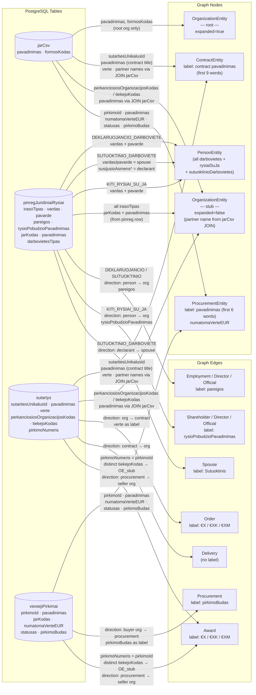
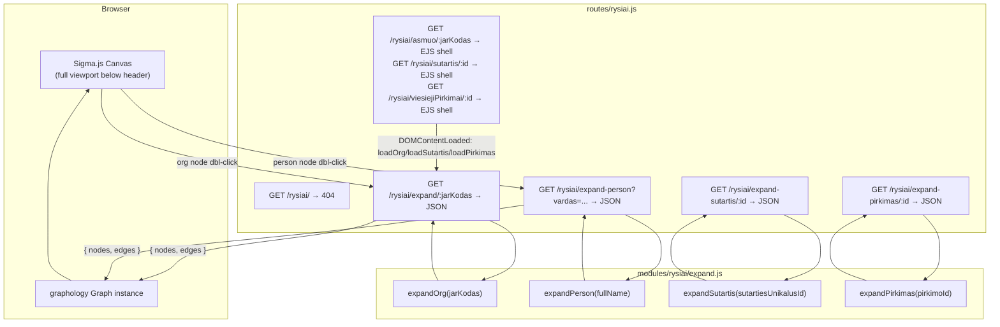
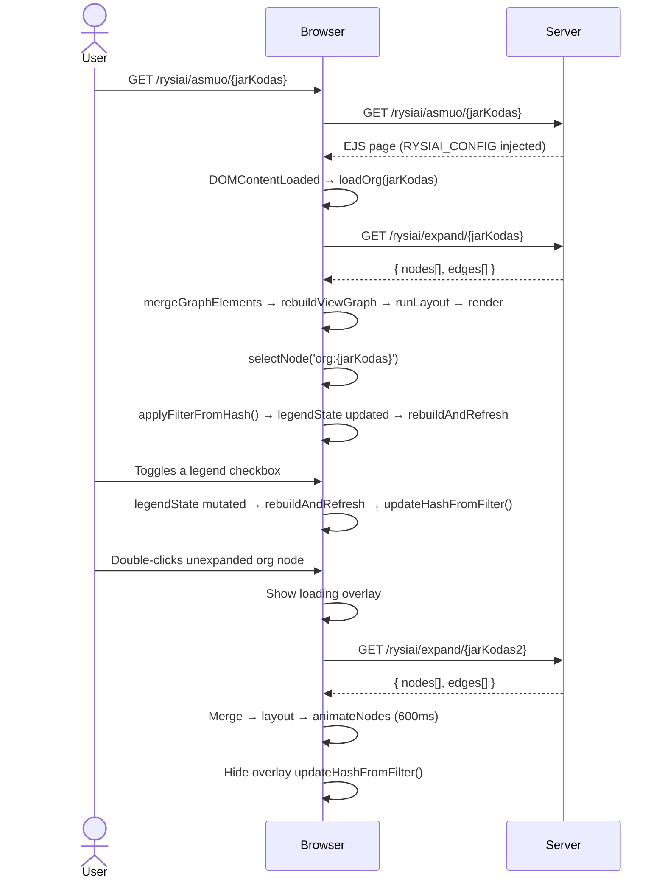
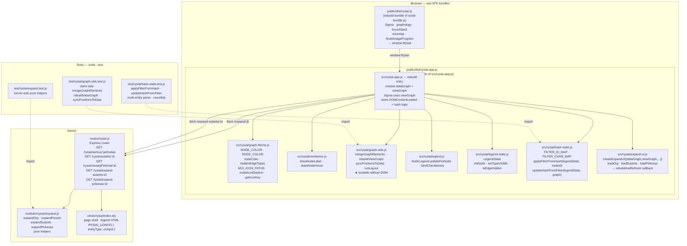

# Ryšiai — Interactive Procurement Network Graph

## Summary

The `/rysiai/` namespace renders an interactive Sigma.js network graph of procurement relationships.
Three typed URL routes open the graph pre-centred on a specific entity:

| URL pattern                             | Center node          |
|-----------------------------------------|----------------------|
| `/rysiai/asmuo/:jarKodas`               | `OrganizationEntity` |
| `/rysiai/sutartis/:sutartiesUnikalusId` | `ContractEntity`     |
| `/rysiai/viesiejiPirkimai/:pirkimoId`   | `ProcurementEntity`  |

The legacy route `/rysiai/:jarKodas` (numeric) is kept for backward compatibility and behaves
identically to `/rysiai/asmuo/:jarKodas`.

Visiting `/rysiai/` without a path segment returns a 404-style "įmonė nenurodyta" page.

If the URL contains a `#filter=` hash on arrival, the filter is applied to the initial node
immediately after it loads. Additional expanded nodes can also be encoded in the hash (see
[URL Hash State Management](#url-hash-state-management)).

Interaction model:

- **Single click** — selects the node and shows its details panel. Clicking the canvas background deselects.
- **Double-click** — expands the node, fetching and merging its connected data into the graph.

The **`#node-details` panel** (top-right overlay, min 200 px / max 240 px) unifies the node details and the edge-type
legend into a single panel. It contains two sub-components:

- **`#rysiai-details`** — type-specific summary of the selected node (title, sub-info, external links).
  For non-configurable expandable nodes (e.g. contract with `pirkimoNumeris`) an **"Išskleisti"** / **"Suskleisti"**
  button is rendered here.
- **`#rysiai-legend`** — shown **only when an org/person node is expanded** (`expanded === true`). Contains:
    - **`#rysiai-legend-checkboxes`** — edge-type and contract-size filter checkboxes. Each row shows the **count of
      that relationship type incident to the selected node** (e.g. "Direktorius / vadovas (5)"). Rows where the count
      is **zero are hidden entirely** — no checkbox is shown for a relationship type that does not exist on the node.
      Contract edges are split into three independently-toggleable size rows:
      "Sutartis (maža)" / "(vidutinė)" / "(didelė)" corresponding to `contractSizeCategory` small / medium / large.
    - **`#rysiai-legend-btn`** — the **"Suskleisti"** (Adjust icon) button for org/person nodes, separated by a
      border-top. Clicking collapses the node: removes expansion-owned edges and orphaned nodes, resets
      `expanded: false`, hides the legend.
      The **"Išskleisti"** (Hub icon) button for not-yet-expanded org/person nodes is rendered in `#rysiai-details`
      (legend is hidden when node is not expanded). Hidden automatically on collapse or when a non-expanded node is
      selected.

MCP is not used for DB queries — direct DB calls are faster and avoid HTTP/SSE overhead; MCP is designed for external AI
clients only.

Stack additions: `sigma@3`, `graphology@0.26`, `graphology-layout-forceatlas2`, `graphology-layout-noverlap`,
`@sigma/node-border`, `@sigma/node-image`. Because these are ESM npm packages targeted at Node, a browser
bundle must be compiled with `esbuild` and served as `public/dist/rysiai.js`.

---

## Technical Breakdown

### Entity & Edge Types

The graph uses the entity and edge model defined in the repository data structures:

| Node type            | Expand trigger                                                             | Source function / data                                                                                                                                                                                                                                                                                                                                        | Key fields                                                                                                   | Details panel link                                                                             |
|----------------------|----------------------------------------------------------------------------|---------------------------------------------------------------------------------------------------------------------------------------------------------------------------------------------------------------------------------------------------------------------------------------------------------------------------------------------------------------|--------------------------------------------------------------------------------------------------------------|------------------------------------------------------------------------------------------------|
| `OrganizationEntity` | Org node double-click                                                      | `jarCsv` (root org metadata — `pavadinimas`, `formosKodas`) + `sutartysSaliuSumos JOIN jarCsv` (partner org names)                                                                                                                                                                                                                                            | `jarKodas`, `pavadinimas`, `formosKodas`                                                                     | `/asmuo/{jarKodas}`                                                                            |
| `PersonEntity`       | Org node double-click                                                      | `pinregJuridiniaiRysiai` filtered by `jarKodas` — all `DEKLARUOJANCIO_DARBOVIETE`, `KITI_RYSIAI_SU_JA`, `SUTUOKTINIO_DARBOVIETE` rows                                                                                                                                                                                                                         | `vardas + pavarde` (name is the identity key), `rysioPradzia`                                                | *(no dedicated page)*                                                                          |
| `PersonEntity`       | Person node double-click                                                   | `pinregJuridiniaiRysiai` filtered by `vardas + pavarde` — returns all darbovietes, governance roles, and spouse relationships for that person                                                                                                                                                                                                                 | Same; all declarations for that name are merged into one node                                                | *(no dedicated page)*                                                                          |
| `ContractEntity`     | Org node double-click (creates node)                                       | `sutartys JOIN jarCsv` (top 30 contracts by value; buyer/seller names from `jarCsv` JOIN)                                                                                                                                                                                                                                                                     | `sutartiesUnikalusId` (node ID key), `pavadinimas` (contract title), `verte`, `pirkimoNumeris` (may be null) | `/sutartis/{sutartiesUnikalusId}` (primary); `/viesiejiPirkimai/{pirkimoNumeris}` (if present) |
| `ContractEntity`     | Contract node double-click (when `pirkimoNumeris` is present)              | `expandContract(pirkimoNumeris)` — fetches full `ProcurementEntity` node (`viesiejiPirkimai WHERE pirkimoId = $1`) + all winner org stubs (`sutartys GROUP BY tiekejoKodas`) + best-effort loser org stubs (`atn1ataskaitos JOIN atn1dalyviai WHERE salis='LT'`, only ~425 procurements covered). Client creates the `ContractLink` edge locally after merge. | Same as above (contract node already in graph)                                                               | *(same, already shown)*                                                                        |
| `ProcurementEntity`  | Org node double-click (buyer) / Contract node double-click (auto-expanded) | Created when buyer org is expanded: `viesiejiPirkimai WHERE jarKodas = $jarKodas ORDER BY numatomaVerteEUR DESC LIMIT 20`. When reached via contract expansion, already fully populated and auto-expanded by `expandContract`.                                                                                                                                | `pirkimoId` (node ID key), `pavadinimas`, `numatomaVerteEUR`, `statusas`, `pirkimoBudas`                     | `/viesiejiPirkimai/{pirkimoId}`                                                                |

> **`ProcurementEntity` is a hub node.** One procurement notice can result in contracts with multiple
> different winners (32,605 of 37,796 procurements have >1 distinct winner — see `docs/DB_ER.md`).
> The procurement node sits between the buyer org and its award recipients: `BuyerOrg → Procurement →
> [WinnerOrg1, WinnerOrg2, …]`. This is fundamentally different from a `ContractEntity` which is
> always a one-to-one buyer↔seller financial document.
>
> **`ContractEntity.pirkimoNumeris`** links a signed contract back to the originating procurement
> notice. When non-null, clicking the contract node expands it to reveal the procurement hub and all
> participants. **`expanded` starts as `false`** when `pirkimoNumeris` is present; the UI click
> handler uses this flag to trigger `expandContract`. When `pirkimoNumeris` is null, the contract
> node is not expandable and keeps `expanded: true`.
>
> **Loser (Bid) coverage is best-effort.** Loser participant data comes from `atn1dalyviai` via
> `atn1ataskaitos.pirkimoNumeris`. Only ~425 of 37,797 procurements have ATN1 data in the DB. When
> no ATN1 data exists for a procurement, only winner `Award` edges are shown — this is normal and
> expected. `atn1dalyviai.kodas` maps to `jarCsv.jarKodas` for Lithuanian companies (`salis = 'LT'`).
> Foreign bidders are excluded (no jarCsv entry).

**Entity ID convention:**

| Entity       | ID format                                                             | Example                 |
|--------------|-----------------------------------------------------------------------|-------------------------|
| Organisation | `org:{jarKodas}`                                                      | `org:110053842`         |
| Person       | `person:{vardas.trim().toLowerCase()} {pavarde.trim().toLowerCase()}` | `person:jonas jonaitis` |
| Contract     | `contract:{sutartiesUnikalusId}`                                      | `contract:2008083561`   |
| Procurement  | `procurement:{pirkimoId}`                                             | `procurement:474742`    |

> **Person identity is name-only.** The same physical person appearing in declarations for different
> organisations will have the same node ID and will be merged into a single graph node automatically
> by graphology's idempotent merge — this is the intended behaviour. `deklaracija` UUIDs are stored
> as a node attribute array (`deklaracijos: string[]`) for audit purposes but are not used as the ID.
> Person nodes must store `vardas` and `pavarde` as separate attributes so the frontend can derive
> the node ID and pass the full name to `expand-person`.

#### Person node expansion — `expandPerson` and `expandOrg` DB mapping

Both functions query `pinregJuridiniaiRysiai` directly — this table stores all pinreg declared
relationships as structured rows, with one row per person↔org link. When a **person node is clicked**,
`expandPerson` filters this table by `vardas + pavarde` (or `susijusioAsmensVardas + susijusioAsmensPavarde`
for spouse relationships), returning all darbovietes, governance roles, and spouse links declared
across every employer that person has ever listed. Each row has an `irasoTipas` classifier that
determines which graph elements to produce:

| `irasoTipas`                | Produces                                                                       | Edge type(s)                                                           |
|-----------------------------|--------------------------------------------------------------------------------|------------------------------------------------------------------------|
| `DEKLARUOJANCIO_DARBOVIETE` | `PersonEntity` (declarant) + `OrganizationEntity` stub                         | `Employment`/`Director`/`Official` — person → org                      |
| `KITI_RYSIAI_SU_JA`         | `PersonEntity` + `OrganizationEntity` stub                                     | `Director`/`Shareholder`/`Official` — person → org                     |
| `SUTUOKTINIO_DARBOVIETE`    | `PersonEntity` (spouse) + `OrganizationEntity` stub + declarant `PersonEntity` | `Employment`/`Director` (spouse → org) + `Spouse` (declarant → spouse) |

| Edge type                               | Direction              | Style           | Source                                                                                                                                                                                                       |
|-----------------------------------------|------------------------|-----------------|--------------------------------------------------------------------------------------------------------------------------------------------------------------------------------------------------------------|
| `Employment` / `Director` / `Official`  | Person → Org           | solid           | `pinregJuridiniaiRysiai` rows with `irasoTipas = DEKLARUOJANCIO_DARBOVIETE`                                                                                                                                  |
| `Employment` / `Director`               | Spouse → Org           | solid           | `pinregJuridiniaiRysiai` rows with `irasoTipas = SUTUOKTINIO_DARBOVIETE`                                                                                                                                     |
| `Shareholder` / `Director` / `Official` | Person → Org           | solid           | `pinregJuridiniaiRysiai` rows with `irasoTipas = KITI_RYSIAI_SU_JA`                                                                                                                                          |
| `Spouse`                                | Person → Person        | solid           | `pinregJuridiniaiRysiai` rows with `irasoTipas = SUTUOKTINIO_DARBOVIETE` (declarant → spouse)                                                                                                                |
| `Order`                                 | Org → Contract         | solid, sized    | `sutartys.topPirkejai` → buyer side                                                                                                                                                                          |
| `Delivery`                              | Contract → Org         | solid, sized    | `sutartys.topTiekejai` → supplier side                                                                                                                                                                       |
| `Procurement`                           | Org → Procurement      | solid           | `viesiejiPirkimai WHERE jarKodas = $jarKodas` — buyer org issued the tender                                                                                                                                  |
| `ContractLink`                          | Contract → Procurement | thin, muted     | Created client-side when a contract node is expanded — links the clicked contract to its procurement hub. Color `#94a3b8` (slate). Size 1.                                                                   |
| `Award`                                 | Procurement → Org      | thin, **green** | `sutartys WHERE pirkimoNumeris = $pirkimoId GROUP BY tiekejoKodas` — winning seller orgs. Color `#22c55e`. Size 1.                                                                                           |
| `Bid`                                   | Procurement → Org      | thin, **red**   | `atn1ataskaitos JOIN atn1dalyviai WHERE pirkimoNumeris = $pirkimoId AND salis='LT'` — procurement participants who did not win. Color `#ef4444`. Size 1. Best-effort: only ~425 procurements have ATN1 data. |

> **Visual style note — thin edges.** Sigma.js does not natively render dashed or dotted lines.
> `ContractLink`, `Award`, and `Bid` are visually distinguished from solid `Order`/`Delivery` edges
> by being **very thin (size 1)** and carrying distinct colors (slate / green / red). If a
> `@sigma/edge-dashed` custom program is added in a future phase, these three edge types are already
> separated and ready to be switched.

> **`irasoTipas` is a record classifier, not a role label.** The three distinct values in the DB are
> `DEKLARUOJANCIO_DARBOVIETE`, `SUTUOKTINIO_DARBOVIETE`, and `KITI_RYSIAI_SU_JA`. They must **never**
> be used as edge labels — they are only used to decide which mapping branch to enter.

#### Data Source → Graph Element Mapping



#### Edge labels

Every edge must carry a visible `label` attribute set at build time in `modules/rysiai/expand.js`:

| Edge type                                                          | `label` value                                                                                                                                                                              |
|--------------------------------------------------------------------|--------------------------------------------------------------------------------------------------------------------------------------------------------------------------------------------|
| `Order` / `Delivery`                                               | Formatted `verte`: `€1.2M`, `€450K`, `€12K`, etc. — see formatting note                                                                                                                    |
| `Procurement`                                                      | `pirkimoBudas` field (e.g. "Atviras konkursas", "Skelbiama apklausa")                                                                                                                      |
| `Award`                                                            | Formatted `verte` sum (total contract value from that seller for this procurement)                                                                                                         |
| `Bid`                                                              | *(empty — no label)*                                                                                                                                                                       |
| `ContractLink`                                                     | *(empty — no label)*                                                                                                                                                                       |
| `Employment` / `Director` / `Official` (person or spouse → org)    | `pareigos` field (free-text job title, e.g. "Direktorius", "Gydytojas"). Never `darbovietesTipas` — that field holds `STANDARTINE`, `EKSPERTO`, or `SUTUOKTINIO` and is not human-readable |
| `Director` / `Shareholder` / `Official` (from `KITI_RYSIAI_SU_JA`) | `rysioPobudzioPavadinimas` field (controlled vocabulary, e.g. "Valdybos narys", "Akcininkas")                                                                                              |
| `Spouse`                                                           | `"Sutuoktinis"`                                                                                                                                                                            |

> **Contract value formatting**: use `Math.round(verte)` and express as `€XM` (millions, 1 dp), `€XK`
> (thousands, 0 dp), or `€X` (under 1000) — e.g. `1234567 → €1.2M`, `45000 → €45K`, `800 → €800`.
> `null`/`0` values display an empty string (no label).

#### Node labels

Node labels are rendered **below** the node. Long names are word-wrapped at **3 words per line**
using a simple space-split utility:

```js
function wrapLabel(name, n = 3) {
    const words = (name ?? '').split(' ');
    const lines = [];
    for (let i = 0; i < words.length; i += n) lines.push(words.slice(i, i + n).join(' '));
    return lines.join('\n');
}
```

| Entity type          | Label source             | Applied as                          |
|----------------------|--------------------------|-------------------------------------|
| `OrganizationEntity` | `pavadinimas`            | `wrapLabel(pavadinimas)`            |
| `PersonEntity`       | `vardas + " " + pavarde` | `wrapLabel(vardas + " " + pavarde)` |
| `ContractEntity`     | contract count           | `"N sut."` (e.g. `"17 sut."`)       |
| `ProcurementEntity`  | `pavadinimas` (6 words)  | `wrapLabel(pavadinimas, 6)`         |

Sigma's default label renderer draws labels to the **right** of the node centre. A custom
`defaultDrawNodeLabel` function must be provided to `new Sigma(graph, container, { defaultDrawNodeLabel })`
to position the label **below** the node (draw at `y + nodeSize + labelPadding`, horizontally centred on `x`).

### Architecture

New server-side module `modules/rysiai/` containing:

- `expand.js` — exported functions:
    - `expandOrg(jarKodas)` — queries `jarCsv` (root org metadata), `pinregJuridiniaiRysiai` (person
      relationships), `sutartys JOIN jarCsv` (top 30 contracts by value), and `viesiejiPirkimai`
      (top 20 procurement notices by `numatomaVerteEUR`) for this org as **buyer**; maps raw rows to
      `GraphNode[]` and `GraphEdge[]`. Returns `{ nodes, edges }`.
    - `expandPerson(fullName)` — queries `pinregJuridiniaiRysiai` directly, matching on
      `vardas + pavarde` or `susijusioAsmensVardas + susijusioAsmensPavarde`; returns **all
      darbovietes, governance roles, and spouse relationships** declared by that person across all
      employers, as stub `OrganizationEntity` nodes + person↔org / spouse edges.
    - `expandProcurement(pirkimoId)` — queries `sutartys WHERE pirkimoNumeris = $pirkimoId GROUP BY
      tiekejoKodas` to find distinct winning seller orgs + `jarCsv JOIN` for their names; returns
      seller `OrganizationEntity` stub nodes + `Award` edges from the procurement node.
    - `expandSutartis(sutartiesUnikalusId)` — **(new)** queries `sutartys JOIN jarCsv` for the single
      contract row; returns the `ContractEntity` node (marked `isRoot: true`) + buyer and seller
      `OrganizationEntity` stub nodes + `Order`/`Delivery` edges. Used when the page opens with a
      contract as the center figure.
    - `expandPirkimas(pirkimoId)` — **(new)** queries `viesiejiPirkimai JOIN jarCsv` for the
      procurement row + buyer org stub; delegates to `expandProcurement` for winner/bidder data;
      returns the `ProcurementEntity` node (marked `isRoot: true`, `expanded: true`) + buyer
      `OrganizationEntity` stub + `Procurement` edge + all winner/bidder stubs. Used when the page
      opens with a procurement as the center figure.
    - All functions return `{ nodes: GraphNode[], edges: GraphEdge[] }`.

New route `routes/rysiai.js`:

| Method | Path                                           | Purpose                                                                                           |
|--------|------------------------------------------------|---------------------------------------------------------------------------------------------------|
| `GET`  | `/rysiai/`                                     | Returns 404 ("įmonė nenurodyta") — no entity given                                                |
| `GET`  | `/rysiai/asmuo/:jarKodas`                      | EJS page shell; `RYSIAI_CONFIG = { entityType: 'asmuo', entityId: jarKodas }`                     |
| `GET`  | `/rysiai/sutartis/:sutartiesUnikalusId`        | EJS page shell; `RYSIAI_CONFIG = { entityType: 'sutartis', entityId: sutartiesUnikalusId }`       |
| `GET`  | `/rysiai/viesiejiPirkimai/:pirkimoId`          | EJS page shell; `RYSIAI_CONFIG = { entityType: 'viesiejiPirkimai', entityId: pirkimoId }`         |
| `GET`  | `/rysiai/:jarKodas`                            | Legacy — numeric jarKodas only; identical to `/rysiai/asmuo/:jarKodas`                            |
| `GET`  | `/rysiai/expand/:jarKodas`                     | JSON: graph nodes+edges for one organisation (calls `expandOrg`)                                  |
| `GET`  | `/rysiai/expand-person`                        | JSON: graph nodes+edges for one person by full name (`?vardas=...`). Calls `expandPerson`.        |
| `GET`  | `/rysiai/expand-procurement/:id`               | JSON: graph nodes+edges for one procurement — its winning seller orgs. Calls `expandProcurement`. |
| `GET`  | `/rysiai/expand-contract/:pirkimoNumeris`      | JSON: procurement hub + winner/loser orgs for a contract. Calls `expandContract`.                 |
| `GET`  | `/rysiai/expand-sutartis/:sutartiesUnikalusId` | JSON: contract + buyer/seller stubs as center load. Calls `expandSutartis`.                       |
| `GET`  | `/rysiai/expand-pirkimas/:pirkimoId`           | JSON: procurement + buyer org + winner/bidder stubs as center load. Calls `expandPirkimas`.       |

> **Route ordering note**: all static path segments (`expand`, `expand-person`, `asmuo`, `sutartis`,
> `viesiejiPirkimai`) must be registered _before_ the `/:jarKodas` wildcard.

Browser bundle `src/rysiai-bundle.js` compiled by esbuild into `public/dist/rysiai.js`:
imports sigma, graphology, layouts, and node-programs; exports nothing — attaches `window.Rysiai`
with `{ Sigma, Graph, forceAtlas2, noverlap, NodeBorderProgram, NodeImageProgram }` so the inline EJS
script can initialise the graph.

#### `RYSIAI_CONFIG` — client bootstrap object

`views/rysiai/index.ejs` inlines a `window.RYSIAI_CONFIG` object that tells `rysiai-app.js` which
entity to load on `DOMContentLoaded`:

```js
// server injects entityType and entityId
window.RYSIAI_CONFIG = {
    entityType: 'asmuo' | 'sutartis' | 'viesiejiPirkimai',
    entityId: '<string>',
};
```

`rysiai-app.js` uses this to call the correct initial load:

| `entityType`       | Initial load call            | Initial selected node    |
|--------------------|------------------------------|--------------------------|
| `asmuo`            | `ui.loadOrg(entityId, null)` | `org:{entityId}`         |
| `sutartis`         | `ui.loadSutartis(entityId)`  | `contract:{entityId}`    |
| `viesiejiPirkimai` | `ui.loadPirkimas(entityId)`  | `procurement:{entityId}` |

`loadSutartis` and `loadPirkimas` are new public methods on the `createExpandUI` return value, calling
`/rysiai/expand-sutartis/:id` and `/rysiai/expand-pirkimas/:id` respectively and marking the root
node as selected after merge.

### Client-side fetch strategy

The project uses **no data-fetching library** anywhere — all client fetch calls in every view are vanilla
`fetch()` with manual `AbortController`, debouncing, and request-ID sequencing (see `views/juridiniai/search.ejs`
for the canonical pattern). `@tanstack/query-core` was considered but is **not used** — reasoning:

- Node expansion is **one-shot and idempotent**: once a node is marked `expanded: true`, it is never
  re-fetched. No stale-while-revalidate, background refresh, or pagination is required.
- Concurrent duplicate clicks on the same unexpanded node are deduplicated with a **`Set<nodeId>`** of
  in-flight requests (consistent with the `inFlightControllers` Map pattern already used in the project).
- Introducing a framework-agnostic query client would be an isolated pattern inconsistent with the
  zero-framework vanilla JS convention throughout all views.

**In-flight deduplication pattern** (to implement in the inline script):

```js
const expandingNodes = new Set(); // IDs currently being fetched

async function loadOrg(jarKodas) {
    const id = `org:${jarKodas}`;
    if (expandingNodes.has(id)) return;
    expandingNodes.add(id);
    try {
        const data = await fetch(`/rysiai/expand/${jarKodas}`).then(r => r.json());
        mergeGraphElements(data);
        graph.setNodeAttribute(id, 'expanded', true);
    } finally {
        expandingNodes.delete(id);
    }
}
```

Same pattern applies to `loadPerson`, keyed by `person:{(vardas+" "+pavarde).trim().toLowerCase()}`.

### Structural Diagram



### Behavioral Diagram



---

## Components

### Component Map



### Module responsibilities

| File                         | Layer  | Purpose                                                                                                                                                                                | DOM required              |
|------------------------------|--------|----------------------------------------------------------------------------------------------------------------------------------------------------------------------------------------|---------------------------|
| `src/rysiai-bundle.js`       | Client | Bundles third-party npm packages; exposes `window.Rysiai`                                                                                                                              | No                        |
| `src/rysiai-app.js`          | Client | esbuild entry; creates `dataGraph` + `viewGraph`; Sigma uses `viewGraph`; wires DOMContentLoaded (entity-type dispatch) + hash application                                             | Yes                       |
| `src/rysiai/graph-theme.js`  | Client | `NODE_COLOR`, `EDGE_COLOR`, `nodeColor`, `hiddenEdgeTypes`, icon paths, sizing helpers                                                                                                 | No                        |
| `src/rysiai/renderers.js`    | Client | `drawNodeLabel`, `drawNodeHover` — Sigma canvas callbacks                                                                                                                              | No (canvas ctx passed in) |
| `src/rysiai/graph-utils.js`  | Client | `mergeGraphElements(dataGraph,...)`, `rebuildViewGraph`, `syncPositionsToData`, `runLayout` — **pure, injected deps**                                                                  | No ★                      |
| `src/rysiai/legend.js`       | Client | `NodeLegend.updateForNode` — shows/hides `#rysiai-legend`; renders counts; hides zero-count rows                                                                                       | Yes (queries DOM)         |
| `src/rysiai/legend-state.js` | Client | `LegendState` — per-node and global edge-type visibility; `isEdgeHidden`, `initNode`, `setTypeVisible`                                                                                 | No                        |
| `src/rysiai/hash-state.js`   | Client | `FILTER_ID_MAP`, `FILTER_CHAR_MAP`; `applyFilterFromHash(legendState, primaryNodeId)`; `updateHashFromFilter(legendState, graph)` — pure (no DOM reads, writes `window.location.hash`) | No (writes hash only)     |
| `src/rysiai/expand-ui.js`    | Client | `createExpandUI({...})` — async fetch + rebuild; `loadOrg`, `loadSutartis`, `loadPirkimas`; returns `rebuildAndRefresh`                                                                | Yes                       |
| `modules/rysiai/expand.js`   | Server | `expandOrg`, `expandPerson`, `expandProcurement`, `expandContract`, `expandSutartis`, `expandPirkimas`, all pure builder helpers                                                       | No                        |
| `routes/rysiai.js`           | Server | Express routes; calls expand functions; renders EJS; injects `RYSIAI_CONFIG`                                                                                                           | No                        |
| `views/rysiai/index.ejs`     | View   | HTML shell; `#node-details` wrapper; `RYSIAI_CONFIG = { entityType, entityId }` inline script                                                                                          | —                         |

**Visual identity — node colours and icons:**

| Entity type          | `NODE_COLOR` key | Hex       | Icon (MUI)                            | Icon key                                           |
|----------------------|------------------|-----------|---------------------------------------|----------------------------------------------------|
| `OrganizationEntity` | `org`            | `#3b82f6` | Business / DomainAdd / AccountBalance | `PrivateCompany` / `PublicCompany` / `Institution` |
| `OrganizationEntity` | `orgStub`        | `#9ca3af` | Business                              | same                                               |
| `PersonEntity`       | `person`         | `#f97316` | Person                                | `Person`                                           |
| `ContractEntity`     | `contract`       | `#10b981` | HistoryEdu                            | `Contract`                                         |
| `ProcurementEntity`  | `procurement`    | `#8b5cf6` | Gavel                                 | `Procurement`                                      |

`ProcurementEntity` uses **purple** (`#8b5cf6`) — distinct from all current node colours. `EDGE_COLOR` entries:

| Edge type      | Color     | Meaning                                    |
|----------------|-----------|--------------------------------------------|
| `Procurement`  | `#8b5cf6` | Org → Procurement                          |
| `ContractLink` | `#94a3b8` | Contract → Procurement (thin, muted slate) |
| `Award`        | `#22c55e` | Procurement → winner org (green)           |
| `Bid`          | `#ef4444` | Procurement → loser/participant org (red)  |

**`ProcurementEntity` node sizing** — same tiers as `ContractEntity`, driven by `numatomaVerteEUR`:

| Estimated value | Node size |
|-----------------|-----------|
| < €100 K        | 8         |
| €100 K – €1 M   | 13        |
| ≥ €1 M          | 19        |

The single most impactful change for testability is the **dependency-injection signature** of
`mergeGraphElements`. Instead of closing over the module-level `graph` and `renderer`, it receives
them as parameters:

```js
// graph-utils.js (Phase 9 signature — hiddenEdgeTypes removed; dataGraph is a pure store)
export function mergeGraphElements(dataGraph, getNodePos, data, fromNodeId) { ...
}

export function rebuildViewGraph(dataGraph, viewGraph, hiddenEdgeTypes) { ...
} // returns newNodeIds[]
export function syncPositionsToData(dataGraph, viewGraph) { ...
}

export function runLayout(graph, forceAtlas2, noverlap) { ...
}
```

In production (`expand-ui.js`):

```js
mergeGraphElements(dataGraph, (id) => renderer.getNodeDisplayData(id), data, fromNodeId);
const newNodes = rebuildViewGraph(dataGraph, viewGraph, hiddenEdgeTypes);
syncPositionsToData(dataGraph, viewGraph);
```

In unit tests — no DOM or Sigma needed:

```js
import Graph from 'graphology';
import {mergeGraphElements, rebuildViewGraph, syncPositionsToData} from '../../src/rysiai/graph-utils.js';

const dataGraph = new Graph({type: 'directed', multi: true});
const viewGraph = new Graph({type: 'directed', multi: true});
const getNodePos = () => null;

mergeGraphElements(dataGraph, getNodePos, data, null);
const newNodes = rebuildViewGraph(dataGraph, viewGraph, new Set(['Official']));
```

This allows testing:

- That `dataGraph` receives all edges unconditionally (no hidden filtering at merge time)
- That `rebuildViewGraph` removes orphan nodes (no visible edges) from `viewGraph`
- That anchor nodes (expanded, non-ContractEntity) survive even when all their edges are hidden
- That `ContractEntity` nodes disappear when `Order`/`Delivery` are in `hiddenEdgeTypes`
- That re-appearing nodes restore their `x`/`y` position from `dataGraph`
- That `syncPositionsToData` correctly copies layout coordinates back to `dataGraph`
- That newly added node IDs are returned by `rebuildViewGraph` (for `animateNodes` call site)

### Two-graph design

A `dataGraph` (permanent store) and a `viewGraph` (Sigma's rendered graph) are maintained separately:

- `dataGraph` — holds **all** fetched nodes and edges unconditionally. Updated only on expand fetches. Never passed to
  Sigma.
- `viewGraph` — passed to `new Sigma(viewGraph, ...)`. Rebuilt by
  `rebuildViewGraph(dataGraph, viewGraph, hiddenEdgeTypes)` after every expand or legend toggle.

**Anchor rule**: a node is always kept in `viewGraph` when
`attrs.expanded === true && attrs.entityType !== 'ContractEntity'`. ContractEntity nodes are not anchors and disappear
when all `Order`/`Delivery` edges are hidden.

**`rebuildViewGraph`**: computes the visible node set (anchors + nodes incident to non-hidden-type edges), syncs
nodes/edges in `viewGraph`, restores saved `x`/`y` from `dataGraph` when re-adding nodes, returns newly added node IDs
for `animateNodes`.

**`syncPositionsToData`**: after every layout pass, copies `x`/`y` from `viewGraph` → `dataGraph` so positions survive
the next rebuild.

**Animation cancel token**: `animateNodes` returns a cancel function stored in `cancelAnimation`. It is called before
each `rebuildViewGraph` to prevent writing attributes to nodes that were just dropped from `viewGraph`.

### Selection state

Single-node selection. Clicking a node sets `highlighted: true; selected: true` on both graphs (Sigma draws the
persistent ring via `drawNodeHover`). `nodeHiddenEdgeTypes: Map<nodeId, Set<string>>` stores per-node edge-filter
state — on first selection a new Set is initialised as a copy of `HIDDEN_BY_DEFAULT`. `currentHiddenSet()` returns the
selected node's Set or the global fallback; `rebuildAndRefresh` always uses `currentHiddenSet()`.

| Visual state       | Ring radius    | Fill                     | Stroke width | Stroke colour |
|--------------------|----------------|--------------------------|--------------|---------------|
| Hover only         | `nodeSize + 4` | `rgba(255,255,255,0.6)`  | `2`          | `data.color`  |
| Selected (± hover) | `nodeSize + 6` | `rgba(255,255,255,0.15)` | `5`          | `data.color`  |

### Node and edge sizing

**Org node size** — computed client-side from raw sodra fields stored in node attributes:

```js
Math.max(attrs.bendrasDraustujuSkaicius || 0, attrs.draustieji || 0, attrs.draustieji2 || 0, 1)
```

| Personnel | Node size |
|-----------|-----------|
| < 10      | 8         |
| 10 – 50   | 13        |
| 50 – 200  | 19        |
| > 200     | 28        |

`expandOrg` fetches raw sodra fields (`draustieji`, `draustieji2`) per org in a single flat query and stores them in
node attributes. `bendrasDraustujuSkaicius = draustieji + draustieji2` is computed client-side; it is **not** a DB
column.

**Contract / Procurement node size** (`contractSize`) and **Order / Delivery edge weight** (`edgeWeight`) — same
thresholds:

| Value         | Node size | Edge `size` |
|---------------|-----------|-------------|
| < €100 K      | 8         | 1           |
| €100 K – €1 M | 13        | 3           |
| > €1 M        | 19        | 6           |

Person nodes keep a fixed `size: 8`. `edgeWeight` is mirrored as a local helper in `modules/rysiai/expand.js` so
`Order`/`Delivery` edges carry their `size` from the server payload.

---

## URL Hash State Management

The URL hash encodes the active filter and any additionally-expanded entities so that the graph state
can be bookmarked and shared. Hash is **read on page load** (`applyFilterFromHash`) and **written
after every filter or expand change** (`updateHashFromFilter`).

### Filter ID ↔ Edge type mapping

Each edge type is represented by a single ASCII character in the hash string:

| `data-edge-types`         | Label                  | Filter char |
|:--------------------------|:-----------------------|:------------|
| `Director`                | Direktorius / vadovas  | `D`         |
| `Shareholder`             | Akcininkas             | `S`         |
| `Official`                | Pareigūnas / oficialus | `O`         |
| `Employment`              | Darbuotojas            | `E`         |
| `Spouse`                  | Sutuoktinis            | `U`         |
| `ContractSmall`           | Sutartis (maža)        | `L`         |
| `ContractMedium`          | Sutartis (vidutinė)    | `M`         |
| `ContractLarge`           | Sutartis (didelė)      | `G`         |
| `Procurement`             | Pirkimo skelbimas      | `P`         |
| `Award`                   | Pirkimo laimėtojas     | `A`         |
| `Bidder`                  | Pirkimo dalyvis        | `B`         |
| `ContractProcurementLink` | Sutartis → pirkimas    | `C`         |

`filter=DSO` means Director + Shareholder + Official are **visible**; all other edge types are
**hidden** for that node. A missing `filter` key means the node's visibility state is left at its
default (from `HIDDEN_BY_DEFAULT`).

### Hash format

```
#filter=<chars>[&<entityType>_<N>=<entityId>&filter_<N>=<chars>...]
```

- `filter` — comma-free string of filter chars for the **primary** (initial) node.
- Additional expanded nodes use `<entityType>_<N>=<entityId>` keys where:
    - `<entityType>` ∈ `{ asmuo, sutartis, viesiejiPirkimai }`
    - `<N>` is a positive integer that also keys `filter_<N>` for that node's filter state
    - `<entityId>` is the entity's database ID

Examples:

```
/rysiai/asmuo/110078991#filter=DSO
/rysiai/asmuo/110078991#filter=DSO&asmuo_2=110078992&filter_2=LMG
/rysiai/asmuo/110078991#filter=DSOELM&sutartis_2=2008083561&filter_2=LG&asmuo_3=110055123&filter_3=DS
```

### `src/rysiai/hash-state.js`

Pure module — no DOM reads; only writes `window.location.hash`.

```js
// Maps filter char → edge type name
export const FILTER_CHAR_MAP = {
    D: 'Director', S: 'Shareholder', O: 'Official', E: 'Employment',
    U: 'Spouse', L: 'ContractSmall', M: 'ContractMedium', G: 'ContractLarge',
    P: 'Procurement', A: 'Award', B: 'Bidder', C: 'ContractProcurementLink'
};

// Maps edge type name → filter char
export const FILTER_ID_MAP = Object.fromEntries(Object.entries(FILTER_CHAR_MAP).map(([k, v]) => [v, k]));
```

#### `applyFilterFromHash(legendState, primaryNodeId)`

1. Parse `window.location.hash` — strip leading `#`, split on `&`, build a `Map<key, value>`.
2. If `filter` key is present: for `primaryNodeId`, call `legendState.initNode(primaryNodeId)` then
   set each edge type visible/hidden according to whether its char appears in the `filter` value.
   All chars listed → **visible**; all chars not listed → **hidden**.
3. For each `<entityType>_<N>` key: note the entity for deferred expansion (see below).
4. For each `filter_<N>` key paired with a loaded node: apply the same char-based visibility to that
   node's `legendState` entry once the node exists in `dataGraph`.
5. Returns `{ additionalEntities: Array<{ entityType, entityId, filterChars, entityNumber }> }` so
   `rysiai-app.js` can load them sequentially after the primary entity.

#### `updateHashFromFilter(legendState, dataGraph)`

1. Collect all node IDs in `dataGraph` that have an explicit `legendState` entry (`hasNodeConfig`).
2. For each configured node, derive its filter string: join the chars of all visible edge types.
3. For the primary node (the one marked `isRoot: true` in `dataGraph`), emit `filter=<chars>`.
4. For each additional expanded node, determine its `entityType` from `attrs.entityType` and its
   `entityId` from the relevant attribute (`jarKodas`, `sutartiesUnikalusId`, or `pirkimoId`). Assign
   ascending `N` values starting from `2`. Emit `<entityType>_<N>=<entityId>&filter_<N>=<chars>`.
5. Set `window.location.hash = '#' + assembled` (no page navigation; replaces fragment only).
   If all nodes are at default (nothing configured), set hash to empty string.

### Integration in `rysiai-app.js`

```
DOMContentLoaded
  → loadOrg/loadSutartis/loadPirkimas (initial entity)
  → selectNode(primaryNodeId)
  → legendState.initNode(primaryNodeId)
  → applyFilterFromHash(legendState, primaryNodeId)
      → if additionalEntities: load each sequentially, then apply their filter_N
  → rebuildAndRefresh()

On legend checkbox change:
  → legendState mutated
  → rebuildAndRefresh()
  → updateHashFromFilter(legendState, dataGraph)

On node expand (double-click):
  → _expand(...)
  → rebuildAndRefresh()
  → updateHashFromFilter(legendState, dataGraph)

On node collapse:
  → collapseGraphData(...)
  → rebuildAndRefresh()
  → updateHashFromFilter(legendState, dataGraph)
```

---

## Out of Scope

- Risk score colouring of nodes/edges
- Toolbar "Balance" button triggering a full ForceAtlas2 pass — v2
- Dashed/dotted edge rendering (Sigma.js has no built-in dash program; thin colored solid lines are used instead — a
  custom renderer can be added in a future phase)

---

## Tasks

> **Phases 1–18 complete.** Core infrastructure (routes, expand.js, Sigma canvas, icons), expand
> animations, loading overlay, edge/node type labels, per-node legend checkboxes with `LegendState`,
> two-graph architecture, per-node selection state, dynamic node/edge sizing, entity-types module,
> SVG legend arrows, ProcurementEntity nodes, double-click expand, expand/collapse button,
> unified `#node-details` panel, button moved to bottom of legend, legend title removed,
> size-based contract filtering (small / medium / large), legend row counts with zero-count hiding
> (`computeEdgeCounts`, `vl-count` spans, `▼`/`▲` expand/collapse buttons). See architecture
> sections above for current implementation state.

---

- [ ] **Browser smoke-test** (manual verification):
    - Expand an org node — legend shows only rows with count > 0; each visible row has `(N)`.
    - Node with no Employment edges: "Darbuotojas" row absent from legend.
    - Node with only large contracts: only "Sutartis (didelė)" size row shown.
    - After expanding a second node that adds new edge types to the first's neighbourhood: legend
      updates correctly on re-selection.

---

1. **ForceAtlas2 in browser**: `graphology-layout-forceatlas2` runs synchronously and blocks the main
   thread for large graphs. For large graphs (>200 nodes) a Web Worker is recommended. For v1,
   synchronous with a capped iteration count is acceptable.

---

### Phase 19 — Typed URL routes

- [ ] **19.1 — Server: 3 new page routes** in `routes/rysiai.js`:
    - `GET /rysiai/asmuo/:jarKodas` — validates numeric jarKodas; renders EJS with
      `{ entityType: 'asmuo', entityId: jarKodas }`
    - `GET /rysiai/sutartis/:sutartiesUnikalusId` — validates numeric id; renders EJS with
      `{ entityType: 'sutartis', entityId }`
    - `GET /rysiai/viesiejiPirkimai/:pirkimoId` — validates numeric id; renders EJS with
      `{ entityType: 'viesiejiPirkimai', entityId }`
    - All 3 registered **before** the legacy `/:jarKodas` wildcard.

- [ ] **19.2 — Server: `expandSutartis(sutartiesUnikalusId)`** in `modules/rysiai/expand.js`:
    - Query `sutartys JOIN jarCsv` for the single row by `sutartiesUnikalusId`.
    - Return `ContractEntity` node (`isRoot: true`, `expanded: true`) + buyer `OrganizationEntity`
      stub + seller `OrganizationEntity` stub + `Order` + `Delivery` edges.
    - Expose as `GET /rysiai/expand-sutartis/:sutartiesUnikalusId`.

- [ ] **19.3 — Server: `expandPirkimas(pirkimoId)`** in `modules/rysiai/expand.js`:
    - Query `viesiejiPirkimai JOIN jarCsv` for the procurement row + buyer org name.
    - Reuse `expandProcurement(pirkimoId)` for winner/bidder stubs.
    - Return `ProcurementEntity` node (`isRoot: true`, `expanded: true`) + buyer
      `OrganizationEntity` stub + `Procurement` edge + all winner/bidder stubs from
      `expandProcurement`.
    - Expose as `GET /rysiai/expand-pirkimas/:pirkimoId`.

- [ ] **19.4 — View: `RYSIAI_CONFIG` change** in `views/rysiai/index.ejs`:
    - Replace `{ jarKodas }` with `{ entityType, entityId }`.
    - Template variables passed from all 4 page routes (asmuo + 3 new).

- [ ] **19.5 — Client: entity-type dispatch** in `src/rysiai-app.js`:
    - Read `window.RYSIAI_CONFIG.entityType` + `entityId`.
    - Route to `ui.loadOrg`, `ui.loadSutartis`, or `ui.loadPirkimas` accordingly.
    - Select the correct initial node ID after load.

- [ ] **19.6 — Client: `loadSutartis` and `loadPirkimas`** in `src/rysiai/expand-ui.js`:
    - `loadSutartis(sutartiesUnikalusId)` — fetches `/rysiai/expand-sutartis/:id`, merges,
      marks root as selected.
    - `loadPirkimas(pirkimoId)` — fetches `/rysiai/expand-pirkimas/:id`, merges, marks root
      as selected.
    - Both exposed on the return value of `createExpandUI`.

---

### Phase 20 — URL hash filter state

- [ ] **20.1 — `src/rysiai/hash-state.js`** — new pure module:
    - Export `FILTER_CHAR_MAP` and `FILTER_ID_MAP` constants (all 12 edge types).
    - `applyFilterFromHash(legendState, primaryNodeId)` — parse hash, apply per-node visibility,
      return `additionalEntities` array.
    - `updateHashFromFilter(legendState, dataGraph)` — collect configured nodes, build and set
      `window.location.hash`.

- [ ] **20.2 — `rysiai-app.js` integration**:
    - After initial load + `selectNode`, call `applyFilterFromHash` for the primary node.
    - For each `additionalEntities` item returned, call the appropriate `ui.load*` then apply
      `filter_N` to that node's legend state.
    - Call `updateHashFromFilter` at the end of every: legend checkbox change, node expand,
      node collapse.

- [ ] **20.3 — Legend checkbox wiring**: `legend.js` / `expand-ui.js` must invoke
  `updateHashFromFilter` after `rebuildAndRefresh` in the checkbox change handler and after
  every expand/collapse completion.

- [ ] **20.4 — Tests `test/rysiai/hash-state.test.js`**:
    - `applyFilterFromHash` with `filter=DSO` sets Director/Shareholder/Official visible,
      hides the rest.
    - `applyFilterFromHash` with no hash leaves state at defaults.
    - `updateHashFromFilter` round-trips: apply → collect → assert hash string.
    - Multi-entity hash: `asmuo_2=...&filter_2=LMG` parsed and returned in `additionalEntities`.
